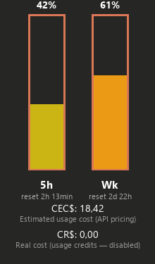

# Claude Usage Widget

A Windows tray widget for tracking Claude Code Pro's 5h and weekly quota, plus
an estimated USD cost for the current month.

## Screenshots

<table>
<tr>
<td align="center"><b>Tray icon</b><br>(compact, updates live)</td>
<td align="center"><b>Detail panel</b><br>(click the icon to open)</td>
</tr>
<tr>
<td align="center"></td>
<td align="center"></td>
</tr>
</table>

*Sample data shown above — not a real account's numbers.* Regenerate these
with `python tools_screenshot.py` (renders straight from the same drawing
code via PIL — no screen capture involved, so it never risks grabbing
whatever else is on your screen).

## How it works

- `statusline_writer.py` is registered as the `statusLine` command in
  `~/.claude/settings.json`. Every time Claude Code renders the status line
  during an active session, it passes `rate_limits.five_hour` and
  `rate_limits.seven_day` via stdin — this script just caches that in
  `~/.claude/usage-cache.json`. That's the official mechanism, no network call
  involved.
- `tray_widget.py` is the process that sits in the tray. It reads the local
  cache every ~20s (pure file read, no network). When the cache goes stale, it
  makes **one single network call** every `NETWORK_POLL_INTERVAL_SECONDS`
  (currently 2 minutes) — never more often than that, whether the previous
  call succeeded or not — to `https://api.anthropic.com/api/oauth/usage`,
  using the OAuth token Claude Code itself already keeps in
  `~/.claude/.credentials.json`. That same response carries both the
  5h/weekly numbers and the real usage credits (CR$), so one call covers both.
  (Why the cooldown exists: an earlier version had two independent checkers
  hammering this endpoint every ~20s with no cooldown at all, which got
  Anthropic to return 429/Too Many Requests. We tested 2 minutes afterward and
  it didn't reproduce the problem — but if Anthropic ever starts returning 429
  at that cadence too, the widget respects the `Retry-After` header it sends
  back and waits exactly that long before trying again.)
- Separately, it scans local session logs (`~/.claude/projects/**/*.jsonl`) to
  add up tokens consumed in the current calendar month and estimate a cost in
  USD at public API pricing (see `pricing.py`) — that's **CEC$** (Estimated
  Consumption Cost). This is incremental — it only reads the new bytes
  appended to each file on every pass, never reprocesses everything from
  scratch.
- **Automatic token refresh**: Claude Code's `accessToken` expires every few
  hours. If a usage call comes back with 401 (expired token), the widget uses
  the `refreshToken` already sitting in `~/.claude/.credentials.json` to get a
  new one (the same OAuth flow Claude Code itself uses) and rewrites the file
  with the new tokens before retrying. It always makes a backup
  (`.credentials.json.bak`) before overwriting. If the refresh itself also
  fails (e.g. the refresh token has fully expired, which takes much
  longer — weeks), only then does opening Claude Code fix it.

## Risks you should know about

- **The fallback endpoint (`/api/oauth/usage`) isn't officially documented by
  Anthropic.** It's the same mechanism community tools (e.g.
  `claude-code-statusline`) already use, but it could change or stop working
  without notice. If that happens, the widget shows "—" instead of a number —
  it doesn't crash.
- **CEC$ (Estimated Consumption Cost) is an estimate**, computed by applying
  the public per-token API price to the tokens found in your local logs.
  **It is not your real Pro subscription bill**, which is a flat monthly fee.
  It's only a reference to gauge whether you're consuming a lot or a little
  relative to what you'd pay on pay-as-you-go API pricing.
- **CR$ (Real Cost) is the actual figure** — it comes from your account's
  `spend` field, the same one shown under Settings → Usage. It stays at 0
  while usage credits are disabled; if you enable them and start spending
  beyond the Pro plan, it reflects the real amount charged.
- **Token refresh touches Claude Code's real login file**
  (`~/.claude/.credentials.json`). The refresh endpoint is also undocumented,
  and the refresh token is single-use (every renewal issues a new one) — that's
  why the widget always rewrites the file immediately after a successful
  refresh, so Claude Code's own next refresh attempt never gets handed a dead
  refresh token. If anything goes wrong mid-write, there's a
  `.credentials.json.bak` of the previous state.
- Prices in `pricing.py` were checked in July 2026 — including Sonnet 5's
  launch discount, which only applies until 2026-08-31. If Anthropic changes
  pricing, update that file (check anthropic.com/pricing).

## Running manually (dev mode)

```powershell
pip install -r requirements.txt
python tray_widget.py
```

Only one instance runs at a time — if you try to open a second one, it warns
you and exits.

## Packaging it to always run

```powershell
.\build.ps1
```

This produces `dist\claude-usage-widget.exe`. Create a shortcut to it in the
Startup folder (`Win+R` → `shell:startup`) so it starts on its own with
Windows.

## Usage

- **Tray icon**: two compact vertical bars (5h and weekly), color shifts from
  green to red as consumption rises. Hover for a tooltip:
  `5h | S | CEC$ | CR$`.
- **Click the icon** (or right-click → Details): opens a panel with the two
  full-size bars, "5h"/"S" labels, and the CEC$/CR$ lines each with a small
  caption underneath. Click anywhere on the panel (or outside it) to close it.
- **Notifications**: a Windows toast whenever either window crosses 80%, and
  again at 95%. Only fires once per threshold, resets when the window itself
  resets.

## Language

The widget detects the Windows UI language (`GetUserDefaultUILanguage`) once,
on startup — currently only `pt` and `en` are supported (see `i18n.py`); any
other Windows language falls back to English. If you change the Windows
language, just reopen the widget to pick up the new one. To add a language,
add an entry to the `STRINGS` dictionary in `i18n.py` with the same keys that
already exist.

## Security (no personal key ever ships with the code)

Nothing here has an API key, token, or password written into the source:

- The `OAUTH_CLIENT_ID` in `tray_widget.py` is public — it's the same client
  id Claude Code CLI itself uses, it's not a secret and doesn't identify you.
- The real token (`accessToken`/`refreshToken`) only ever exists in
  `~/.claude/.credentials.json`, **outside the project folder**, read at
  runtime. If you hand this folder to someone (zip, USB drive, GitHub —
  whatever), it doesn't carry that file along, and the other person wouldn't
  get access to your account just from the code.
- Every state/cache/log file the widget creates (`usage-cache.json`,
  `usage-widget-state.json`, etc.) also lives in `~/.claude/`, never inside
  the project folder — so copying/sharing the `claude-usage-widget/` folder
  never drags any of your usage data along with it.
- A `.gitignore` is already set up as an extra safety net in case a
  credentials-like file ever ends up in this folder by mistake.

## Sharing it with other people

Since each person has their own `~/.claude/.credentials.json` and their own
logs, the code already works for anyone with Claude Code Pro on Windows with
no changes needed — whoever runs it sees their own account's numbers, not
yours. Two ways to hand it off:

- **Just the folder/zip** (simplest): the other person runs `pip install -r
  requirements.txt` then `python tray_widget.py`, or you hand them the `.exe`
  built by `build.ps1` (then they don't even need Python installed).
- **Git repository** (good for going public or keeping several people
  updated easily): `git init` this folder — the `.gitignore` already guards
  against a credentials file being committed by accident.

## State files (all under `~/.claude/`, none of them need to be versioned)

- `usage-cache.json` — last known quota data (statusline or fallback).
- `usage-credits-cache.json` — last known real usage-credits data (CR$).
- `usage-widget-state.json` — incremental read offsets for the logs, plus
  accumulated cost for the month, per file.
- `usage-widget.lock` — single-instance lock.
- `usage-widget-debug.log` — only gets lines when something fails silently
  (e.g. the fallback API being unavailable). Empty means everything's fine.
